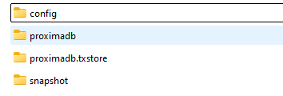

# Node Docker Setup

This setup lets you run a Proxima node in the public testnet using Docker.

The only tools required are git and docker. 
The setup was tested on Linux and Windows 11 with WSL2.

First get the Proxima repository and checkout the testnet branch with these commands:

```bash
git clone https://github.com/lunfardo314/proxima.git
cd proxima
git checkout origin/testnet
```

Then change the directory:
```bash
cd tests/node-docker-setup
```
Now we can run an access node.


## Running an access mode

Make sure the peering port 4000 is open.

To start the node execute the command

```bash
./run.sh
```

This will build (if started for the first time) and run a node in access mode. It also downloads the most recent snapshot file if run for the first time. It will ask for sudo pwd. Downloading the snapshot can take a while depending on the size.  
To manually download the snapshot and create the DB from it use

```bash
./update-snapshot.sh
```

After the node is started the following directories are created under `./data/`:

<div align="center">
    
</div>

`config` contains:  
`proxima.yaml` with the node settings, e.g. node id  
`proxi.yaml` with your wallet settings, e.g. account address and the secret key.  
You can adapt these files to your needs. The changes will be copied to the docker image with a restart.  
To restart the node, press CTRL+C and then `./run.sh`.

`proximadb` and `proximadb.txstore` contain the DB files.


## Playing with the access node

The CLI wallet program `proxi` is used for the following actions.
For a comprehensible overview of this tool, look into [docs/proxi.cmd](../../docs/proxi.md)

To access this tool on the node you have to attach a shell to the docker node. One way to achieve this would be with visual studio code using its docker extension. 
You can also ask ChatGPT how to attach a shell with the docker tools (ask "How to attach a shell to a docker node?").

To set editable access rights for the config files under `./data/config` use

```bash
sudo chmod 666 data/config/*.yaml
```

#### Requesting funds from the faucet

The proxi tool can be found in the directory `/app` on the node.

First check the balance of the wallet:

```bash
./proxi node balance
```

To request funds from the faucet use 

```bash
./proxi node getfunds
```
There should be no error output.

Then after some seconds check the wallet balance again.
It should now show a balance like this:

```bash
TOTALS:
amount controlled on 1 non-chain outputs: 1_000_000
TOTAL controlled on 1 outputs: 1_000_000
```

#### Spamming

For spamming some settings have to be made in `./data/config/proxi.yaml` under the `spammer` section:

set the `sequencer_id` under `tag_along` to a valid sequencer id, e.g. `6393b6781206a652070e78d1391bc467e9d9704e9aa59ec7f7131f329d662dcc`.

set the `target` to a valid target lock, you can use the account address of your wallet for example.

Now restart the node to activate the changes in `proxi.yaml`.

Now you can start spamming with the command

```bash
./proxi node spam
```

## Setup a sequencer

To setup a sequencer you can use the steps described in [docs/run_sequencer.cmd](../../docs/run_sequencer.md)

Remember that you have to edit the config files in `./data/config/`.
